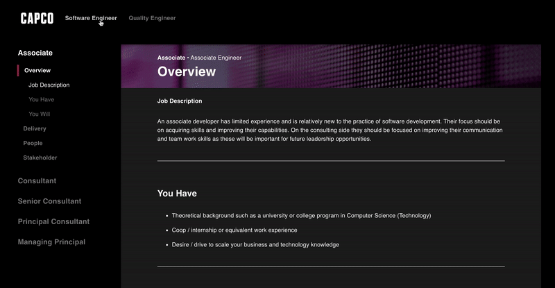

Digital Engineering Framework

A **React - TypeScript** web application that provides a more readable format of the existing [Engineering Competency Framework](https://capcoinc.sharepoint.com/:x:/r/sites/UKDigitalEngineering/_layouts/15/doc2.aspx?sourcedoc=%7BE1C11EB9-AA6D-4EA7-8C01-B4E4842265F2%7D&file=Capco%20Engineering%20Competency%20Matrix.xlsx&action=default&mobileredirect=true&cid=1e0a1d1b-aae6-428e-b0b8-62702919b614) to help explain performance expectations. Visit the deployed app [here](https://master.din0piv439nis.amplifyapp.com/).

## Installation

Clone the master branch and run the following scripts in the project directory:

- `npm install` - to install relevant dependencies

- `npm start` - start the react app

- `npm test` - run unit tests

- `npm run cypress` - run e2e ui tests

Unit and E2E UI tests are automated via [GitHub Actions](https://github.com/capcodigital/engineering-framework/actions).

## Resources

| Description                                                        | Link                                                                      |
| :----------------------------------------------------------------- | :------------------------------------------------------------------------ |
| React - JavaScript library for building user interfaces            | [React](https://github.com/facebook/create-react-app)|
| Cypress - JavaScript E2E Testing Framework| [Cypress](https://www.cypress.io/)  |
| React Testing Library - light-weight solution for testing React components| [React Testing Library](https://www.cypress.io/)  |
| Library that utilises tagged template literals to style React components | [styled components](https://styled-components.com/)                       |
